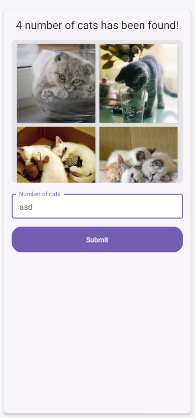

# Edric React Native Coaching Week1

In this tutorial, we'll build a Random Cat Generator app using React Native. The app will allow users to fetch and display a specified number of random cat images in a grid layout.
The end result should look like this:


## Prerequisites

- Basic understanding of React Native
- Node.js and npm installed
- React Native development environment set up
- Basic knowledge of async/await and API calls

## Step 1: Installation and Setup

Create a new React Native project using Expo. Open your terminal and run:

```
npx create-expo-app --template blank RandomCatApp
cd RandomCatApp
```

Let's install all the necessary dependencies. Open your terminal in your React Native project directory and run:

```bash
npm install react-native-paper
npm install react-native-safe-area-context
```

### Understanding the Dependencies

1. **react-native-paper**:

   - A Material Design component library for React Native
   - Provides pre-built components like Surface, Button, and TextInput
   - Ensures consistent and beautiful UI across your app

2. **react-native-safe-area-context**:
   - Handles safe area insets on different devices (especially important for iOS)
   - Prevents content from being hidden behind notches, status bars, or navigation bars
   - Essential for creating a professional-looking app

## Step 2: Understanding Key Components

Before we start coding, let's understand two important components we'll be using:

### SafeAreaView

```javascript
import { SafeAreaView } from "react-native-safe-area-context";
```

- Automatically adds padding to avoid system UI elements
- Ensures content is visible on all devices
- Essential for iOS devices with notches

### Surface

```javascript
import { Surface } from "react-native-paper";
```

- A container component that provides elevation and background color
- Creates a card-like effect with shadows
- Helps organize and separate content visually

## Step 3: Basic Structure and Cat Image Fetching

Let's start by creating the component and implementing the cat fetching functionality:

```javascript
import React, { useEffect, useState } from "react";
import { Dimensions, Image, ScrollView, StyleSheet, View } from "react-native";
import { Surface, Text } from "react-native-paper";
import { SafeAreaView } from "react-native-safe-area-context";

const windowWidth = Dimensions.get("window").width;

const CatGenerator = () => {
  const [cats, setCats] = useState([
    {
      url: "https://cdn2.thecatapi.com/images/8cd.jpg",
    },
    {
      url: "https://cdn2.thecatapi.com/images/8ob.jpg",
    },
    {
      url: "https://cdn2.thecatapi.com/images/a0v.jpg",
    },
    {
      url: "https://cdn2.thecatapi.com/images/akf.jpg",
    },
  ]);
  const [error, setError] = useState("");

  const fetchCats = async (count) => {
    try {
      const response = await fetch(
        `https://api.thecatapi.com/v1/images/search?limit=${count}`
      );
      const data = await response.json();
      setCats(data.slice(0, count));
    } catch (error) {
      setError("Failed to fetch cats");
    }
  };

  return (
    <SafeAreaView style={styles.container} edges={["top", "left", "right"]}>
      <Surface style={styles.surface}>
        <Text variant="titleLarge" style={styles.title}>
          {cats.length
            ? `${cats.length} number of cats has been found!`
            : "Random Cat Generator"}
        </Text>

        <View style={styles.scrollContainer}>
          <ScrollView style={styles.scrollView}>
            <View style={styles.imageGrid}>
              {cats.map((cat, index) => (
                <Surface key={`${cat.id}-${index}`} style={styles.imageSurface}>
                  <Image source={{ uri: cat.url }} style={styles.image} />
                </Surface>
              ))}
            </View>
          </ScrollView>
        </View>
      </Surface>
    </SafeAreaView>
  );
};
```

Add these styles for the basic structure:

```javascript
const styles = StyleSheet.create({
  container: {
    flex: 1,
    backgroundColor: "#f5f5f5",
  },
  surface: {
    height: "100%",
    margin: 16,
    padding: 16,
    borderRadius: 8,
    elevation: 4,
  },
  title: {
    marginBottom: 16,
    textAlign: "center",
  },
  scrollContainer: {
    flex: 4,
    marginBottom: 16,
  },
  scrollView: {
    flex: 1,
    backgroundColor: "#e0e0e0",
    borderRadius: 8,
  },
  imageGrid: {
    flexDirection: "row",
    padding: 8,
    gap: 8,
    justifyContent: "center",
  },
  imageSurface: {
    width: (windowWidth - 32 - 32 - 30) / 2,
    height: (windowWidth - 32 - 32 - 30) / 2,
    borderRadius: 8,
    overflow: "hidden",
    backgroundColor: "#fb923c",
  },
  image: {
    width: "100%",
    height: "100%",
    resizeMode: "cover",
  },
});
```

> **Note**: The `Surface` component from react-native-paper does not work well with the `flex` property. Instead of using `flex`, setting an explicit `height` (like `height: "80%"`) will work better for controlling the Surface's size.

### Group Exercise

1. The layout does not look quite right. Can you try to fix it?
2. The cat url is hardcoded for the first time. Can you make it dynamic?

## Step 4: Adding User Input and Submit Functionality

Now let's add the ability for users to specify how many cats they want to see:

```javascript
import { Button, TextInput } from "react-native-paper";

// Add these state variables at the top of your component
const [inputValue, setInputValue] = useState("");

// Add this function to your component
const handleSubmit = () => {
  const numCats = parseInt(inputValue);

  if (numCats > 10) {
    setError("Maximum number of cats is 10");
    return;
  }

  setError("");
  fetchCats(numCats);
};

// Add this JSX right after the ScrollView closing tag
<View style={styles.inputContainer}>
  {error ? <Text style={styles.errorText}>{error}</Text> : null}
  <TextInput
    label="Number of cats"
    value={inputValue}
    onChangeText={setInputValue}
    keyboardType="numeric"
    mode="outlined"
    style={styles.input}
  />
  <Button mode="contained" onPress={handleSubmit} style={styles.button}>
    Submit
  </Button>
</View>;
```

Add these additional styles:

```javascript
// Add these to your StyleSheet
inputContainer: {
  gap: 16,
  flex: 2,
},
input: {
  backgroundColor: "white",
},
button: {
  paddingVertical: 6,
},
errorText: {
  color: "red",
  textAlign: "center",
}
```

### Group Exercise

1. When user input is not a valid number, all the cat disappears. Can you fix it?

## Step 5: Add keyboard avoiding view

```javascript
import { KeyboardAvoidingView } from "react-native";

<KeyboardAvoidingView behavior={Platform.OS === "ios" ? "padding" : "height"}>
  {/* The rest of your code */}
</KeyboardAvoidingView>;
```

`KeyboardAvoidingView` is a component that automatically adjusts its position to avoid the keyboard. It's especially useful for iOS devices to prevent the input field from being hidden behind the keyboard.

## Next Steps for Enhancement

You can improve your app by:

1. Adding a loading state while fetching images
2. Implementing pull-to-refresh
3. Adding error retry functionality
4. Saving favorite cats
5. Adding cat breed information

Don't forget to export your component:

```javascript
export default CatGenerator;
```

Happy coding! 🐱
